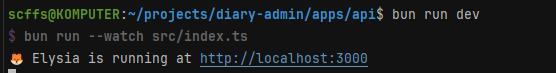
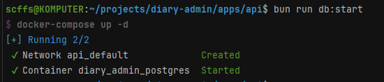
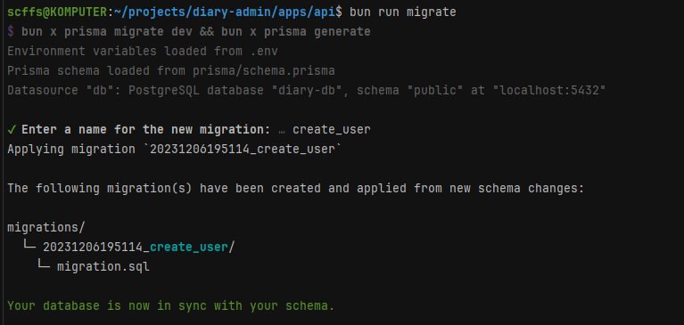

# API

# Установка

### Необходимо иметь на локальной машине:

- bun
- bunx (обычно скачивается вместе с bun)
- Docker

**Если вы сделали это еще в самом корне проекта, то отдельно делеть этого не надо**

### Скачать зависимости:

```bash
bun i
```

# Разработка

### Для запуска сервера:

```bash
bun run dev
```



### Для запуска БД (в докере!):

```bash
bun run db:start
```



### Для запуска миграций:

```bash
bun run migrate
```



#### API доступен по урлу http://localhost:3000/
