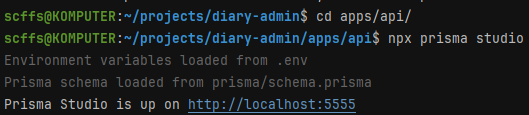
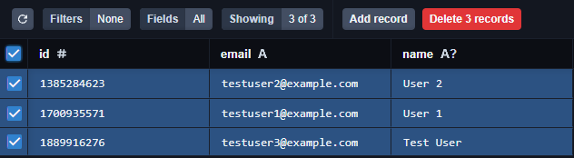

# Тесты


- Для тестов использовать ЧИСТУЮ ТЕСТОВУЮ БД
- Запускать БД как обычно в докере
- После запуска тестов надо удалить БД, иначе след. запуск тестов может упасть из-за повторяющихся данных

### Как очистить БД
#### Запуск studio
```bash
cd apps/api
npx prisma studio
```



#### Удаление

